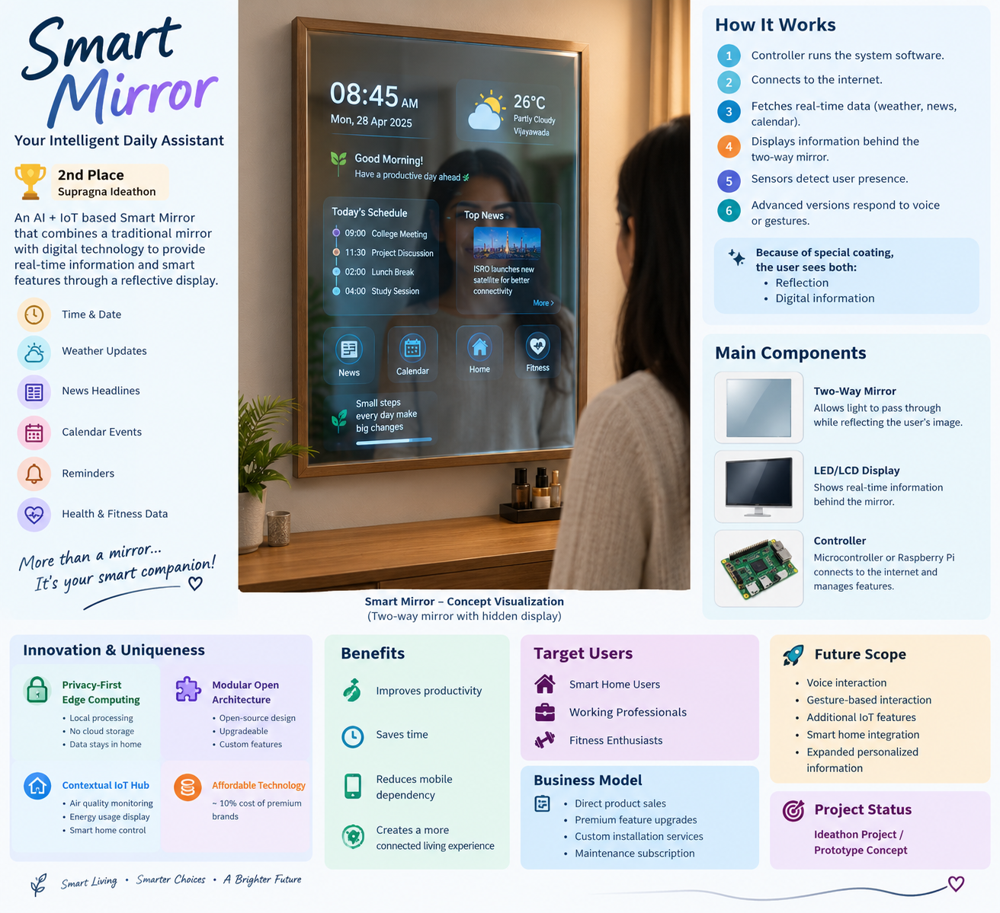

# 🪞 Smart Mirror

## 🏆 2nd Place — Supragna Ideathon

An IoT-based Smart Mirror concept that combines a traditional mirror with digital technology to provide real-time information and smart features through a reflective display.

---

## 👩‍💻 Team

- **P. Venkata Sai Pranathi**
- **P. Gayathri Siva Priya**

---

## 💡 Project Overview

The Smart Mirror combines a traditional mirror with advanced digital technology.

It is designed to provide useful information such as:

- 🕐 Time and date
- 🌤️ Weather updates
- 📰 News headlines
- 📅 Calendar events
- 🔔 Reminders
- ❤️ Health and fitness data

The information is designed to appear on the reflective surface without blocking the user's reflection.

---

## 🎨 Concept Visualization

> **Note:** This is an AI-generated concept visualization of the proposed Smart Mirror. It represents the project design concept and is **not a photograph of a physical prototype**.

---

## ⚙️ Working Principle

The proposed Smart Mirror works through the following process:

1. The controller runs the system software.
2. The system connects to the internet.
3. Real-time information such as weather, news and calendar data is fetched.
4. The information is displayed behind the two-way mirror.
5. Sensors can detect user presence.
6. Advanced versions can respond to voice or gestures.

Because of the special mirror coating, the user can see both:

- Their reflection
- Digital information

---

## 🧩 Main Components

### 🪞 Two-Way Mirror

A specialized mirror that allows light from the display to pass through while reflecting the user's image.

### 🖥️ LED/LCD Display

A high-resolution display that shows real-time information behind the mirror.

### ⚙️ Controller

A microcontroller or Raspberry Pi can process data, connect to the internet and manage the mirror's features.

---

## 🚀 Innovation & Uniqueness

### 🔐 Privacy-First Edge Computing

- Face and gesture recognition can be processed locally.
- No cloud data storage.
- User data can remain within the home.

### 🧩 Modular Open Architecture

- Open-source design
- Easily upgradeable
- Custom feature integration

### 🏠 Contextual IoT Hub

The Smart Mirror can be extended to support:

- Air quality monitoring
- Energy usage display
- Smart home control

### 💰 Affordable Technology

The concept focuses on providing advanced smart-mirror features at an affordable cost compared with premium brands.

---

## ✨ Benefits

The Smart Mirror is designed as an intelligent daily assistant that provides essential information through an interactive dashboard.

It aims to:

- Improve productivity
- Save time
- Reduce dependency on mobile devices
- Create a more connected living experience

---

## 🎯 Target Users

The proposed solution is aimed at:

- 🏠 Smart home users
- 💼 Working professionals
- 🏋️ Fitness enthusiasts

---

## 💼 Business Model

### Revenue Streams

- Direct product sales
- Premium feature upgrades
- Custom installation services
- Maintenance subscription

### Scalability

- Easy production scaling
- Modular feature expansion
- Compatibility with future IoT devices

---

## 🏆 Achievement

### 🥈 2nd Place — Supragna Ideathon

The Smart Mirror project was presented as an IoT-based smart living solution.

---

## 📄 Project Presentation

The complete project presentation is available in this repository:

**Smart-Mirror-Presentation.pdf**

The presentation contains the project's introduction, working principle, components, innovation, benefits, market analysis, business model and future scope.

---

## 🔮 Future Scope

Potential future extensions include:

- 🎙️ Voice interaction
- 👋 Gesture-based interaction
- 🏠 Smart home integration
- 📡 Additional IoT features
- 📊 Expanded personalized information
- 🔒 Further privacy-focused local processing

---

## 📌 Project Status

**Ideathon Project / Prototype Concept**

This repository documents the Smart Mirror concept presented at the Supragna Ideathon. A physical hardware prototype was not developed as part of this project.

---

## 📚 Documentation

| Resource | Description |
|---|---|
| `Smart-Mirror-Presentation.pdf` | Complete project presentation |
| `smart-mirror-concept.png` | AI-generated concept visualization |

---

## 🌱 Vision

**Smart Living • Smarter Choices • A Brighter Future**
